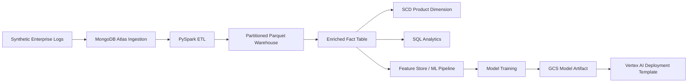
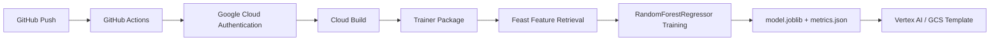

# Big Data ETL, Warehouse Modeling, and GCP MLOps Template

> Enterprise-style data engineering and MLOps project covering synthetic log generation, MongoDB-style ingestion, PySpark ETL, Parquet warehouse modeling, SCD dimension logic, SQL analytics, and a Vertex AI / Cloud Build deployment template.

[]()
[]()
[]()
[]()
[]()
[]()

---

## Overview

This repository demonstrates an end-to-end **enterprise data engineering and MLOps workflow**.

The project simulates transactional and operational logs, ingests them into a MongoDB-style workflow, processes them with PySpark, builds a warehouse-style enriched fact table, applies Slowly Changing Dimension logic, produces SQL analytics outputs, and includes a Vertex AI-compatible model-training template.

The core pipeline is:

```text
Synthetic Logs → MongoDB Atlas → PySpark ETL → Parquet Warehouse → SCD Modeling → SQL Analytics → Vertex AI / Cloud Build Template
```

This project is best understood as a **portfolio-scale implementation and architecture template**. Several data engineering components are implemented and locally verified, while cloud-specific MLOps components require project-specific GCP credentials, IAM, buckets, APIs, and Feast configuration.

See [`PROJECT_STATUS.md`](PROJECT_STATUS.md) for the implementation status of each component.

---

## Why This Project Matters

Modern data platforms often require more than a notebook or single model training script. Real enterprise ML systems need:

- reliable ingestion,
- scalable transformation,
- warehouse-ready data modeling,
- historical dimension tracking,
- analytical outputs,
- cloud-compatible training code,
- and CI/CD templates for deployment.

This project connects those layers into a single repo so that the data pipeline and MLOps pipeline can be understood together.

---

## Architecture

Detailed diagrams are available in [`docs/architecture.md`](docs/architecture.md).

### End-to-End Pipeline



### MLOps Template



---

## Implemented Components

| Layer | Status |
|---|---|
| Synthetic sales, user activity, and inventory log generation | Implemented and locally verified |
| Product-ID alignment with product master data | Implemented |
| MongoDB Atlas ingestion workflow | Implemented, cloud-dependent |
| PySpark ETL notebooks | Implemented in notebook workflow |
| Partitioned Parquet warehouse outputs | Implemented |
| Enriched fact table sample rebuild | Implemented and locally verified |
| SCD Type 1 / Type 2 product dimension modeling | Implemented in data/notebook workflow |
| SQL revenue analytics queries | Implemented |
| Revenue summary artifact | Implemented |
| Vertex-compatible trainer script | Prototype / template |
| Feast feature retrieval | Prototype / cloud-dependent |
| GitHub Actions + Cloud Build | Template / cloud-dependent |

---

## Repository Structure

```text
big-data-etl-warehouse-pipeline/
├── 1_log_simulation/
│   └── simulate_logs.py
├── 2_mongo_ingestion/
│   ├── upload_to_mongo.py
│   └── extract_sales.py
├── 4_data_warehouse/
│   └── warehouse/
│       └── fact_sales_enriched/
│           └── fact_sales_enriched_sample.parquet
├── 5_scd_dimension_modeling/
│   ├── product_master.csv
│   ├── dim_product_history.csv
│   └── product_updates/
│       └── product_master.csv
├── 6_analytics/
│   ├── query_revenue.sql
│   └── sample_revenue_summary.csv
├── 7_vertex_ai_ml_pipeline/
│   ├── trainer/
│   │   ├── task.py
│   │   └── setup.py
│   └── .github/
│       └── workflows/
│           └── train_and_deploy.yml
├── docs/
│   └── architecture.md
├── notebooks/
│   ├── 1_log_simulation_and_ingestion.ipynb
│   ├── 2_etl_with_pyspark.ipynb
│   ├── 3_warehouse_modeling_scd.ipynb
│   └── 4_ml_pipeline_vertexai.ipynb
├── rebuild_sample_warehouse.py
├── cloudbuild.yaml
├── PROJECT_STATUS.md
├── requirements.txt
├── LICENSE
└── README.md
```

---

## Data Generation

The project generates three synthetic enterprise log types:

| Log Type | Example Fields |
|---|---|
| Sales logs | `sale_id`, `customer_id`, `product_id`, `region`, `quantity`, `price`, `timestamp` |
| User activity logs | `user_id`, `action_type`, `page`, `device`, `timestamp` |
| Inventory events | `product_id`, `warehouse_id`, `stock_level`, `reorder_triggered`, `timestamp` |

The sales and inventory generators now use product IDs aligned with the product master:

```text
P101, P102, P103, P104
```

This ensures product metadata joins succeed during warehouse enrichment.

---

## Warehouse Modeling

The warehouse sample focuses on an enriched sales fact table joined with product dimension history.

The regenerated fact table contains:

```text
1300 rows × 17 columns
```

Key fields include:

```text
sale_id
customer_id
product_id
product_name
category
price_band
region
quantity
price
line_revenue
timestamp
sale_date
sale_year
sale_month
is_current
start_date
end_date
```

Product metadata coverage is clean after regeneration:

| Field | Null Rate |
|---|---:|
| `product_name` | 0.0 |
| `category` | 0.0 |
| `price_band` | 0.0 |

---

## SCD Dimension Modeling

The project includes product master and product history files for Slowly Changing Dimension workflows:

```text
5_scd_dimension_modeling/product_master.csv
5_scd_dimension_modeling/dim_product_history.csv
5_scd_dimension_modeling/product_updates/product_master.csv
```

The dimension history captures current and historical product attributes such as:

- product name,
- category,
- price band,
- current-record flag,
- start date,
- end date.

This supports SCD Type 1 / Type 2 modeling patterns in the notebook workflow.

---

## Analytics Layer

The SQL analytics layer is defined in:

```text
6_analytics/query_revenue.sql
```

It includes queries for:

- revenue by product category,
- revenue by region,
- top products by revenue,
- monthly revenue trend.

A sample analytics output is committed at:

```text
6_analytics/sample_revenue_summary.csv
```

Example revenue summary:

| Category | Region | Total Orders | Total Units Sold | Total Revenue | Avg Order Value |
|---|---|---:|---:|---:|---:|
| Forceps | West | 77 | 246 | 14232.67 | 184.84 |
| Stapler | South | 89 | 253 | 13737.91 | 154.36 |
| Holder | North | 87 | 232 | 13676.46 | 157.20 |
| Stapler | East | 90 | 266 | 13588.36 | 150.98 |

The exact values may change when the sample warehouse is regenerated because the data is synthetic.

---

## Rebuilding the Sample Warehouse

A local rebuild script is included:

```text
rebuild_sample_warehouse.py
```

Run:

```bash
python rebuild_sample_warehouse.py
```

This script:

1. generates aligned synthetic sales logs,
2. joins sales with the current product dimension,
3. rebuilds `fact_sales_enriched_sample.parquet`,
4. creates `sample_revenue_summary.csv`,
5. reports product metadata null rates,
6. prints revenue by category.

Expected output includes:

```text
Fact shape: (1300, 17)

Product metadata null rates:
product_name    0.0
category        0.0
price_band      0.0
```

---

## MongoDB and PySpark ETL Workflow

The notebook workflow includes:

```text
notebooks/1_log_simulation_and_ingestion.ipynb
notebooks/2_etl_with_pyspark.ipynb
```

These cover:

- generating synthetic logs,
- uploading logs to MongoDB Atlas collections,
- connecting PySpark to MongoDB through the MongoDB Spark Connector,
- cleaning and transforming logs,
- writing partitioned Parquet outputs.

The MongoDB workflow is cloud-dependent and requires a valid MongoDB Atlas URI.

---

## Vertex AI / MLOps Template

The repository includes a Vertex-compatible trainer package:

```text
7_vertex_ai_ml_pipeline/trainer/task.py
7_vertex_ai_ml_pipeline/trainer/setup.py
```

The trainer prototype:

- initializes a Feast feature store,
- retrieves historical user features,
- trains a `RandomForestRegressor`,
- evaluates RMSE,
- saves `model.joblib`,
- writes `metrics.json`,
- uses `AIP_MODEL_DIR` for Vertex-compatible model output.

The trainer package dependencies are declared in `setup.py`.

---

## GitHub Actions and Cloud Build

The repository includes a GitHub Actions workflow:

```text
7_vertex_ai_ml_pipeline/.github/workflows/train_and_deploy.yml
```

The workflow:

- runs on pushes to `main`,
- checks out the repository,
- authenticates to Google Cloud using `GCP_CREDENTIALS`,
- sets up the Cloud SDK,
- triggers Cloud Build.

The root-level `cloudbuild.yaml` is included as a deployment template for packaging the trainer and preparing a future Vertex AI job submission.

Cloud execution requires project-specific setup:

- GCP project ID,
- Cloud Build API,
- Vertex AI API,
- GCS bucket,
- service account permissions,
- GitHub secret `GCP_CREDENTIALS`,
- Feast feature repository configuration.

---

## Notebooks

| Notebook | Purpose |
|---|---|
| `1_log_simulation_and_ingestion.ipynb` | Generate synthetic enterprise logs and upload to MongoDB Atlas |
| `2_etl_with_pyspark.ipynb` | Extract logs with PySpark, transform them, and write Parquet |
| `3_warehouse_modeling_scd.ipynb` | Build warehouse-style fact/dimension tables and SCD logic |
| `4_ml_pipeline_vertexai.ipynb` | Prototype Feast, GCS, and Vertex AI model workflow |

---

## Technologies Used

| Tool / Framework | Role |
|---|---|
| Python | Core scripting and local rebuild workflow |
| Faker | Synthetic enterprise log generation |
| Pandas | Sample warehouse rebuild and analytics artifact creation |
| PySpark | Distributed ETL and warehouse modeling notebooks |
| MongoDB Atlas | Cloud NoSQL ingestion target |
| Parquet | Warehouse-style storage format |
| Spark SQL | Analytics query layer |
| Feast | Feature store prototype |
| scikit-learn | Recommender/regression trainer prototype |
| joblib | Model serialization |
| Google Cloud Storage | Model artifact target |
| Vertex AI | Model training/deployment target |
| GitHub Actions | CI/CD trigger template |
| Cloud Build | GCP build/deployment template |

---

## How to Run Locally

Clone the repository:

```bash
git clone https://github.com/AjaySreekumar47/big-data-etl-warehouse-pipeline.git
cd big-data-etl-warehouse-pipeline
```

Create and activate a virtual environment:

```bash
python -m venv .venv
```

On Windows:

```bash
.venv\Scripts\activate
```

On macOS/Linux:

```bash
source .venv/bin/activate
```

Install dependencies:

```bash
pip install -r requirements.txt
```

Rebuild the sample warehouse:

```bash
python rebuild_sample_warehouse.py
```

Inspect the analytics output:

```bash
cat 6_analytics/sample_revenue_summary.csv
```

On Windows PowerShell:

```powershell
type 6_analytics\sample_revenue_summary.csv
```

---

## Environment Variables and Secrets

Do not hardcode credentials.

Use environment variables for cloud and database settings:

```text
MONGO_URI=
GCP_PROJECT_ID=
GCP_REGION=
GCS_BUCKET=
```

GitHub Actions expects a repository secret:

```text
GCP_CREDENTIALS
```

---

## Limitations

This repository is a portfolio-scale implementation and template, not a one-command production deployment.

Current limitations:

- data is synthetic,
- MongoDB and GCP workflows require external credentials,
- Feast repository configuration is not fully portable,
- Vertex AI deployment is template-stage,
- Cloud Build requires project-specific settings before live execution,
- notebooks may require path and credential updates in Colab.

These limitations are intentional and documented so that the repo remains transparent and reproducible where possible.

---

## Future Improvements

Potential extensions:

- add a fully local PySpark runner,
- add unit tests for synthetic log schema validation,
- add Great Expectations checks for warehouse outputs,
- add a dbt-style semantic layer,
- add cost-aware GCP deployment instructions,
- add a working Feast repository example,
- add model evaluation plots,
- add Cloud Run or FastAPI batch inference endpoint,
- add a dashboard over warehouse KPIs.

---

## Author

Created by **Ajay Sreekumar**.

This project demonstrates data engineering, warehouse modeling, analytics engineering, and MLOps architecture using PySpark, MongoDB-style ingestion, Parquet, SCD modeling, SQL analytics, and GCP deployment templates.

---

## License

This project is licensed under the MIT License. See `LICENSE` for details.
