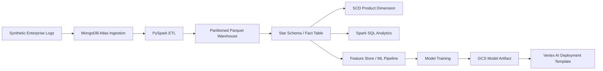
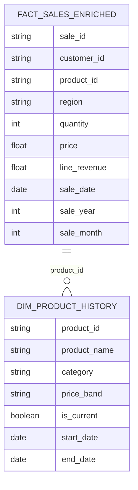
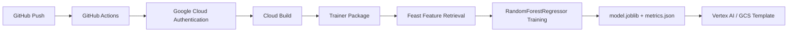

# Architecture

This project is organized as an end-to-end enterprise data engineering and MLOps workflow.

## End-to-End Data Pipeline

## Warehouse Modeling

## MLOps Template

## Component Status

| Layer | Status |
|---|---|
| Synthetic data generation | Implemented and locally verified |
| Product ID alignment | Implemented |
| Warehouse sample rebuild | Implemented |
| Revenue analytics output | Implemented |
| MongoDB Atlas ingestion | Implemented, cloud-dependent |
| PySpark ETL notebooks | Implemented in notebook workflow |
| SCD Type 1 / Type 2 modeling | Implemented in notebook/data workflow |
| Feast + Vertex trainer | Prototype / template |
| GitHub Actions + Cloud Build | Template / cloud-dependent |